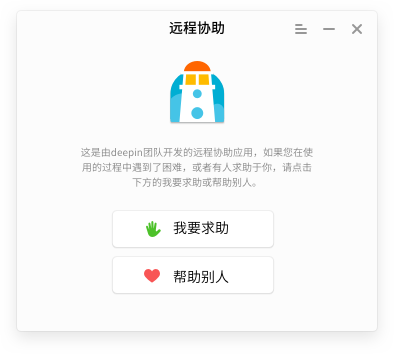
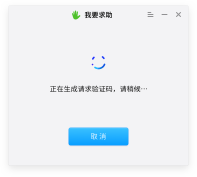
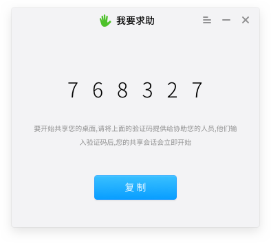
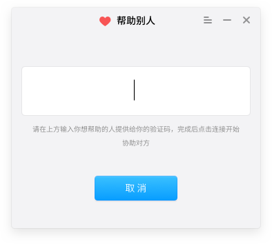
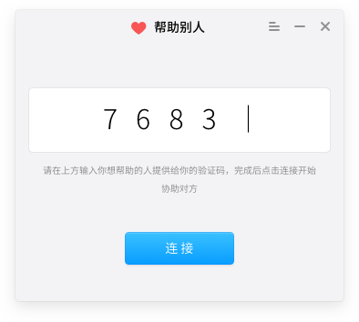
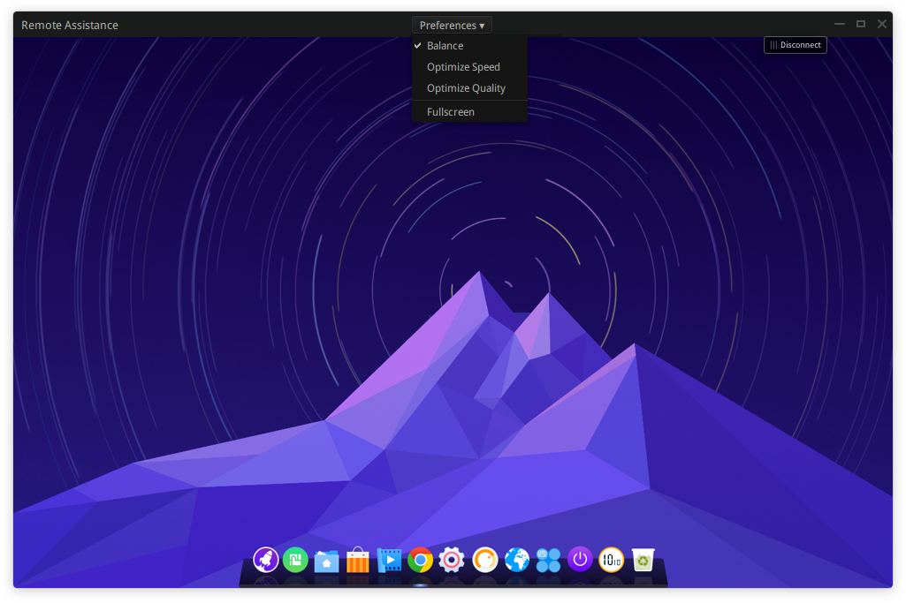
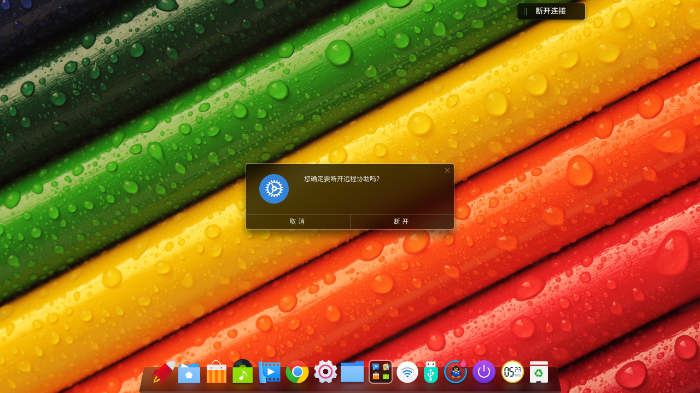

# Remote Assistance|../common/deepin-remote-assistance.svg|

Remote Assistance is used to help users and technicians to solve all kinds of issues, and seek for help when issues are encountered. With Remote Assistance, remote work, training and interactive teaching can be easily done.

## Assist Me|../common/icon_remoteassistance.svg|

If you encountered an issue and need online help, by starting Remote Assistance, you can share your desktop to another user to remotely assist you.

1. Click on  at the bottom of desktop or move the mouse pointer to the upper left corner of the screen, enter into launcher interface.
2. Locate and click on .
3. On Remote Assistance interface, click on **Assist me**.
4. The system will randomly generate a 6-digit verification code.
5. Click on **Copy**, then send the verification code to others to assist you.

> : "Connecting, please wait..." will be shown on the interface, it will automatically hide to dock after successfully connected.

## Assist Others|../common/icon_remoteassistance.svg|

If another user requests for your assistance, you can access the other user's desktop by inputing the verification code obtained from the user.

1. Obtain verification code from the other user.
2. Enter Launcher interface, click on **Remote Assistance**.
3. On Remote Assistance interface, click on **Assist others**, then manually input or paste the verification code.
4. Click on **Connect**, it will automatically access the other user's desktop.

> : If you did not use the verification code timely, or it can not connect by the verification code, please obtain a new one.

## Establish Connection|../common/icon_remoteassistance.svg|

### Remote Desktop Settings

After inputting the verification code, the system will access the remote desktop, you can execute control operations to the desktop. Meanwhile, you can set the display effect of the remote desktop.

After successfully connected to remote desktop, click on **Preferences** collapse menu, you can:
- Select **Optimize quality** to optimize the screen display quality of the remote desktop.
- Select **Optimize speed** to optimize the performance of remote assistance.
- Select **Balance**, the remote desktop will be in balance status.
- Select **Fullscreen** to switch to fullscreen mode and makes it easier for you to execute remote operations.

### Disconnect Remote Desktop

When remote control operations are completed, you can disconnect with a button in the remote desktop.

1. A disconnect button will be shown on the other user's desktop.
2. Click on **Disconnect**, the system will notify you to make sure if you want to disconnect with remote desktop.
3. Click on **Confirm** to end this remote assistance operation.

> : You also can click on **Disconnect** in "Assist me" interface to end the operation.

## Settings|../common/icon_remoteassistance.svg|

### About

You can click "About" to view the introduction of Remote Assistance.

1. On Remote Assistance interface, click on .
2. Click on **About**.
3. View the version and introduction of Remote Assistance.

### Help

You can click "Help" to read the manual, which will help you further know and use Remote Assistance.

1. On Remote Assistance interface, click on .
2. Click on **Help**.
3. View the manual of Remote Assistance.

### Exit

You can click menu bar to exit Remote Assistance.

1. On Remote Assistance interface, click on .
2. Click on **Exit**.

> : You can also click on  in Remote Assistance interface.
