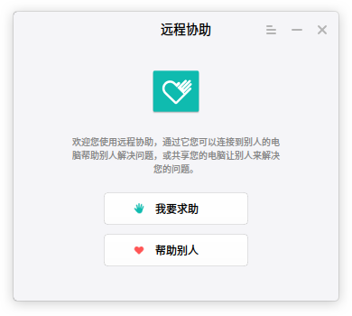
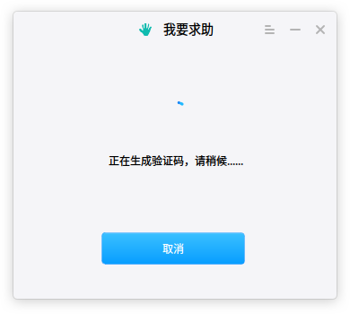
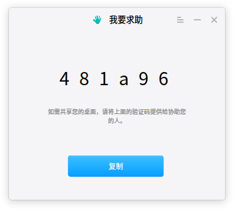
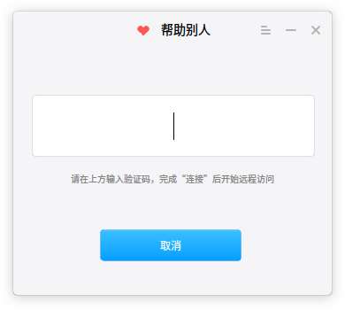
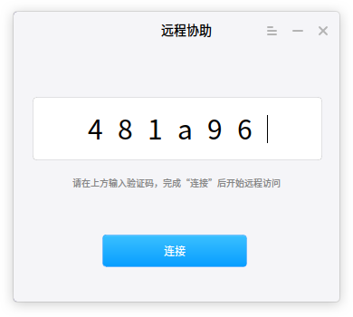
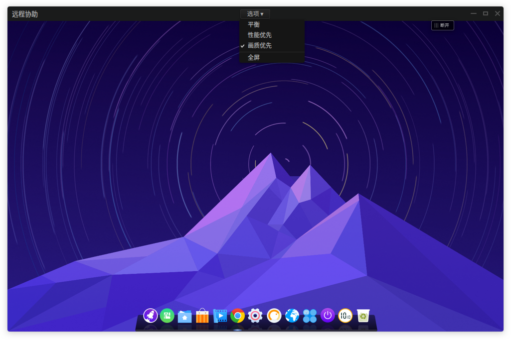
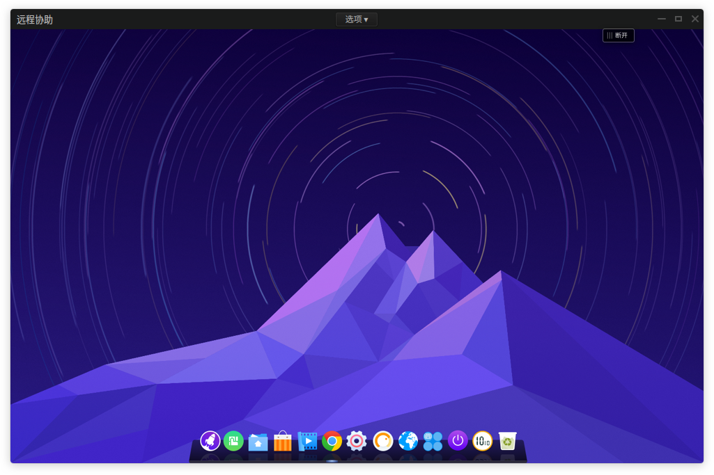

# 远程协助|../common/deepin-remote-assistance.svg|

远程协助主要是帮助用户、技术人员解决各种问题，同时遇到问题可以发起寻求别人的帮助，通过远程协助可以轻松的实现远程工作、培训、交互式教学等。

## 我要求助|../common/icon_ineedhelp.svg|

当您遇到问题需要在线寻求帮助时，可以发起远程协助求助功能，共享桌面给对方来进行远程协助操作。

1. 点击桌面底部的 或将鼠标指针移到屏幕左上角，进入启动器界面。
2. 通过浏览找到  进行点击运行。
3. 在远程协助界面，点击 **我要求助**。
4. 系统会自动随机生成六位数的验证码。
5. 点击 **复制**，将验证码提供给对方进行远程求助。

> ：界面将提示“正在连接，请耐心等待...”，如果连接成功后，求助界面将自动隐藏到任务栏上。

## 帮助别人|../common/icon_ihelpful.svg|

当其他人请求远程协助时，您可以向对方获取已产生的验证码，输入验证码并进入对方的桌面。

1. 获取对方的验证码。
2. 进入启动器界面，点击 **远程协助**。
3. 在远程协助界面，点击 **帮助别人**，手动输入或直接粘贴验证码。
4. 点击 **连接**，系统自动连接并进入对方的桌面。

> ：如果您长时间未使用该验证码或使用该验证码不能正常连接，请重新获取新的验证码。

## 建立连接|../common/icon_remoteassistance.svg|

### 设置远程桌面

当您输入验证码成功后，系统会自动进入对方的远程桌面中，您可以对桌面进行控制操作，还可以设置远程桌面显示的效果。

当您连接远程桌面成功后，点击 **选项** 下拉菜单，您可以：
- 设置 **画质优先**，保证远程协助桌面的画面达到最佳显示。
- 设置 **性能优先**，使远程协助的性能达到最优状态。
- 设置 **平衡**，使远程桌面达到平衡的状态。
- 设置 **全屏**，调整到全屏模式以便您更加方便的进行远程操作。

### 断开远程桌面

当您完成远协助相关操作后，可以通过远程协助桌面中的按钮来结束并断开连接。

1. 在对方的桌面上系统会显示断开按钮。
2. 点击 **断开连接**，系统提示您确定需要关闭远协助桌面连接。
3. 点击 **确定**，您可以结束本次远程协助操作。

> ：您还可以点击“我在求助”界面上 **断开** 按钮来结束操作。

## 选项设置|../common/icon_optionsettings.svg|

### 关于

您可以点击关于查看远程协助的版本介绍。

1. 在远程协助界面，点击 。
2. 点击 **关于**。
3. 查看关于远程协助的版本和介绍。

### 帮助

您可以点击帮助获取远程协助的帮助手册，通过帮助进一步让您了解和使用远程协助。

1. 在远程协助界面，点击 。
2. 点击 **帮助**。
3. 查看关于远程协助的帮助手册。

### 退出

您可以进入菜单栏点击退出远程协助。

1. 在远程协助界面，点击 。
2. 点击 **退出**。

> ：您也可以在远程协助界面中点击  按钮来退出。
